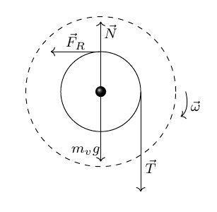
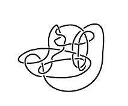
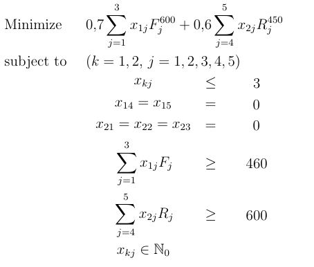

  </a>

# Latex Preamble

In this repo you will find a file called `Preamble.tex` with many useful commands and packages for writing in Latex.

### A few examples:

##### Physics

##### Knot theory

##### Optimization:

###### And many more!

## Contributing 🖇️

Any contributions are highly appreciated. Read the [contributing guidelines](https://github.com/Uklizdev/Latex-Preamble/blob/master/CONTRIBUTING.md) for more info!

## License 📄

This project is [MIT](https://choosealicense.com/licenses/mit/) licenced

⌨️ with ❤️ by [Ukliz](https://github.com/Uklizdev) 😊
